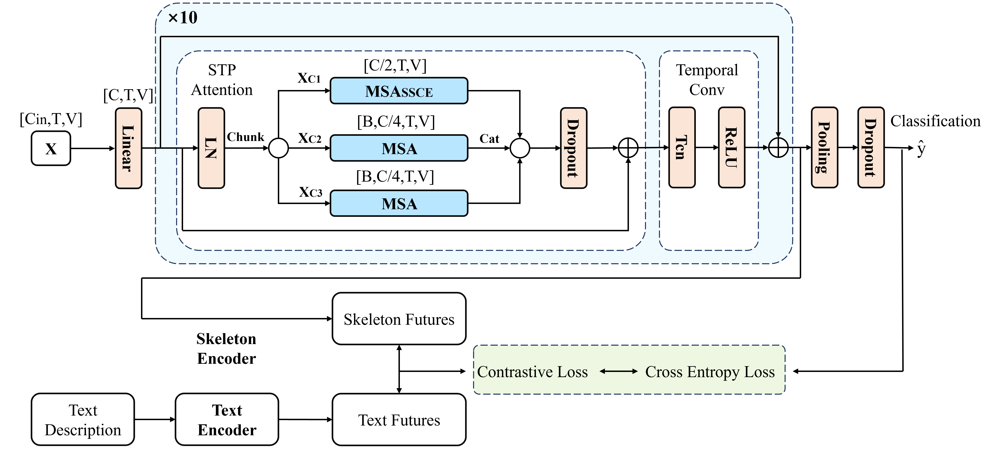
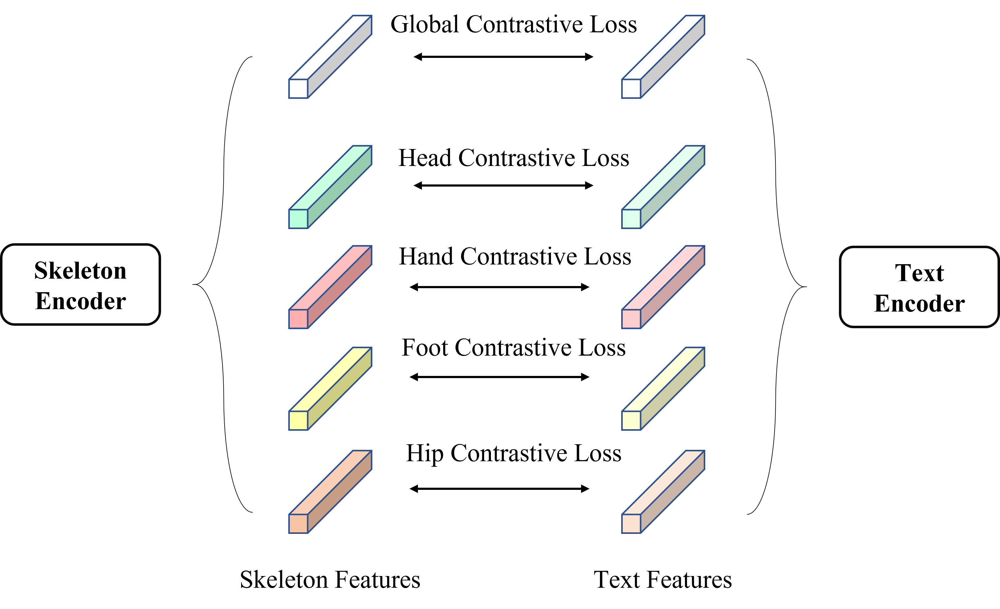
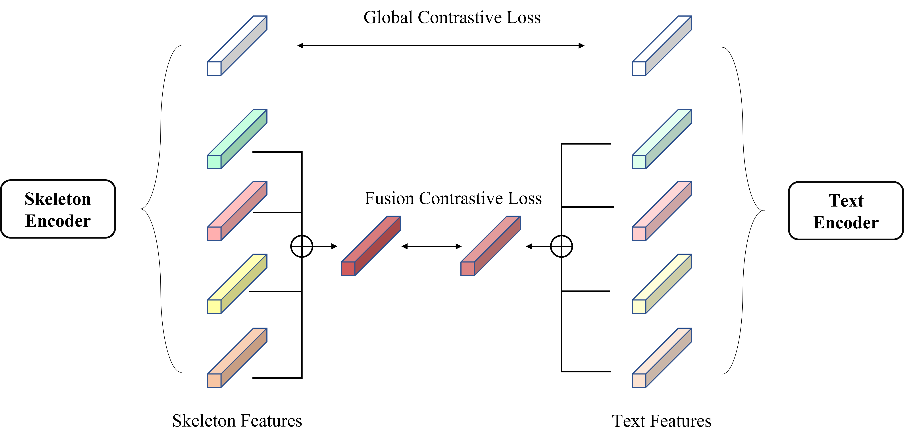

# Hyperformer
This is the official implementation of our work ST-PaSeNet.

## Excellent Efficiency
| Model | Parameters | NTU 60 | NTU 120 |
| -------- | ------- | ------- | -------- |
| DST-HCN | 2.93M | 88.8 | 90.7 |
| STFD-Net | 4.3M | 89.3 | 90.9 |
| MSS-GCN | 7.0M | 88.9   | 90.6 |
| ST-PaSeNet | 2.5M(1.9M) | 89.4 | 90.9    |

## Network Architechture
<p align="center">
   
</p>


## Semantic Guidance

### Multi-Branch Independent Semantic Guidance

<p align="center">
   
</p>


# 


### Hierarchical Semantic Guidance

<p align="center">
   
</p>


# Preparation
### Download datasets.

#### There are 3 datasets to download:

- NTU RGB+D 60 Skeleton
- NTU RGB+D 120 Skeleton
- NW-UCLA

#### NTU RGB+D 60 and 120

1. Request dataset here: https://rose1.ntu.edu.sg/dataset/actionRecognition
2. Download the skeleton-only datasets:
   1. `nturgbd_skeletons_s001_to_s017.zip` (NTU RGB+D 60)
   2. `nturgbd_skeletons_s018_to_s032.zip` (NTU RGB+D 120)
   3. Extract above files to `./data/nturgbd_raw`

#### NW-UCLA

1. Download dataset from [CTR-GCN](https://github.com/Uason-Chen/CTR-GCN)
2. Move `all_sqe` to `./data/NW-UCLA`

### Data Processing

#### Directory Structure

Put downloaded data into the following directory structure:

```
- data/
  - NW-UCLA/
    - all_sqe
      ... # raw data of NW-UCLA
  - ntu/
  - ntu120/
  - nturgbd_raw/
    - nturgb+d_skeletons/     # from `nturgbd_skeletons_s001_to_s017.zip`
      ...
    - nturgb+d_skeletons120/  # from `nturgbd_skeletons_s018_to_s032.zip`
      ...
```

#### Generating Data

- Generate NTU RGB+D 60 or NTU RGB+D 120 dataset:

```
 cd ./data/ntu # or cd ./data/ntu120
 # Get skeleton of each performer
 python get_raw_skes_data.py
 # Remove the bad skeleton 
 python get_raw_denoised_data.py
 # Transform the skeleton to the center of the first frame
 python seq_transformation.py
```

# Evaluation

We provide the [pretrained model weights](https://github.com/ZhouYuxuanYX/Hyperformer/releases/download/pretrained_weights/hyperformer_pretrained_weights.zip) for NTURGB+D 60 and NTURGB+D 120 benchmarks.

To use the pretrained weights for evaluation, please run the following command:

```
bash evaluate.sh
```

# Training & Testing

### Training

```
python mainStage.py --config config/nturgbd-cross-subject/joint.yaml --device 0 --base-lr 2.5e-2 --model model.STPaSeNet.Model_lst_4part
```

Please check the configuration in the config directory.

### Testing

```
python mainStage80.py --weights pretrained weights/ntu 60/joint/runs-128-80128.pt --phase test --save-score True --config config/nturgbd-cross-subject/joint.yaml --device 0 --start-epoch 128 --model model.STPaSeNet.Model_lst_4part

python mainStage80.py --weights pretrained weights/ntu 120/joint/runs-124-122016.pt --phase test --save-score True --config config/nturgbd120-cross-subject/joint.yaml --device 0 --start-epoch 124 --model model.STPaSeNet.Model_lst_4part
```

To ensemble the results of different modalities, run the following command:

```
bash ensemble.sh
```

## Acknowledgements

This repo is based on and [CTR-GCN](https://github.com/Uason-Chen/CTR-GCN). The training strategy is based on [InfoGCN](https://github.com/stnoah1/infogcn).

Thanks to the original authors for their work!

## Citation

Not done yet.

# Contact
For any questions, feel free to contact: hejunhui@stu.ynu.edu.cn

